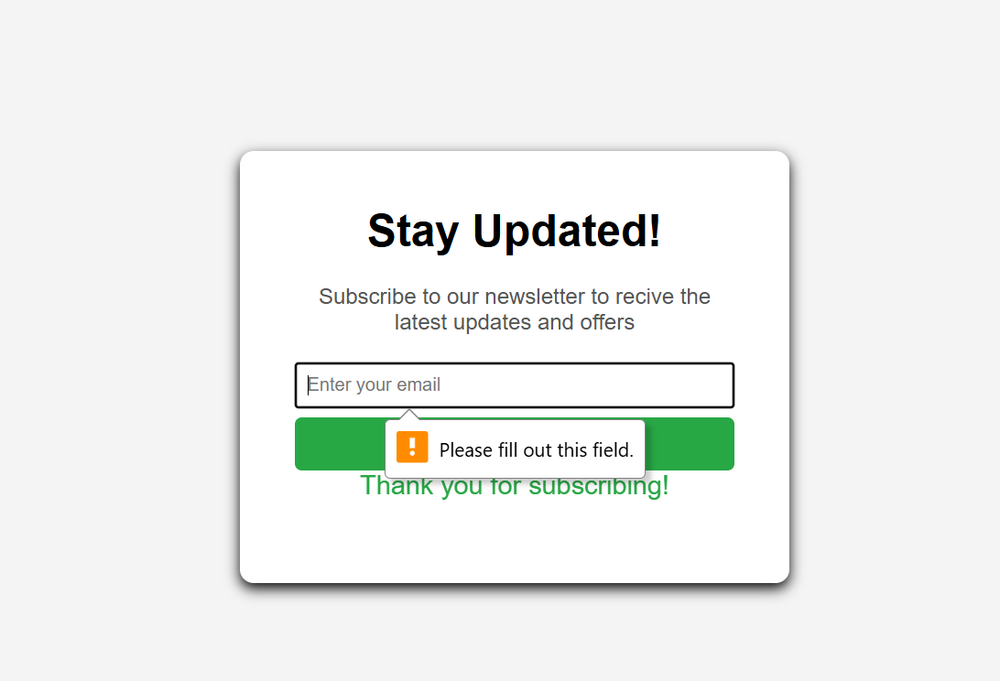

# 📧 Email Subscription Landing Page

A minimal and responsive email subscription landing page built with HTML, CSS, and JavaScript.  
Perfect for newsletters, product updates, or marketing campaigns.

---

## ✨ Features

- 📬 Clean and modern design
- ✅ Simple email subscription form
- 💡 Success message on submission
- 📱 Fully responsive layout
- 🔒 Basic HTML form validation

---

## 📷 Preview

---

## 🛠️ Tech Stack

- HTML5
- CSS3
- JavaScript (Vanilla)

---

## 🚀 How to Use

1. Clone the repository:
   ```bash
   git clone https://github.com/Muzamil-Fatima/email-subscription-landing-page
````

2. Open the folder and run:

   ```bash
   open index.html  # (or just double-click it)
   ```

3. Customize styles or form behavior as needed in `style.css` and `script.js`.

---

## 📂 Project Structure

```
email-subscription-landing-page/
│
├── index.html
├── style.css
├── script.js
└── README.md
```

---

## 📄 License

This project is licensed under the [MIT License](LICENSE).

---

## 🙌 Contributing

Pull requests are welcome! For major changes, please open an issue first to discuss.